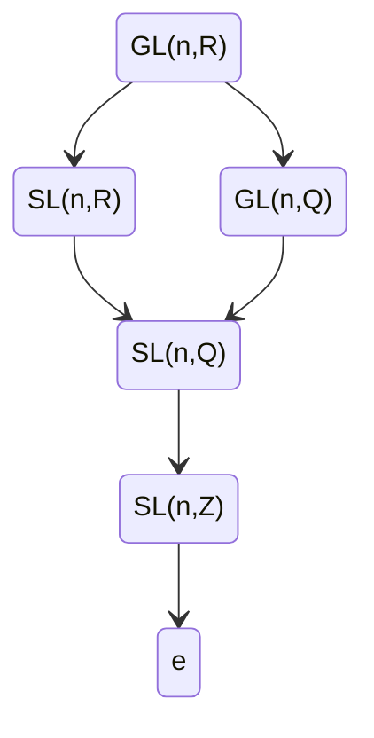

# 群论

## 1. 二元运算

$X是任意的集合, 那么任意的映射\tau: X*X->X称为X上的二元代数运算$

$$
推论:\ a\in X\ \&\&\ b\in X\ \&\&\ c=a*b =>\ c\in X
$$

**二元运算*的结合性定义:**
$作用于集合S中的二元运算*是结合的\ <=>\ all(a*(b*c)==a*(b*c)\ for\ a,b,c \in S^3)$
**二元运算*的交换性定义:**
$作用于集合S中的二元运算*是交换的\ <=>\ all(a*b==b*a\ for\ a,b \in S^2)$

## 半群

**半群的定义：**
$集合X与其上的二元运算符*所组成的二元组(X,*)称为一个半群\ <=>\ all((a*b)*c==a*(b*c)\ for\ a,b,c \in X^3)$
**无限可数半群的定义：**
$\{(X,*)是一个半群;\{(X,*)是无限可数半群\ <=>\ X是一个无限可数集合\}\}$
**无限不可数半群的定义:**
$\{(x,*)是一个半群;\{(x,*)是无限不可数半群\ <=>\ X是一个无限不可数集合}\}$
**有限半群的定义:**
$\{(X,*)是一个半群;\{(x,*)是有半群\ <=>\ X是一个有限集合\}\}$
**实现**

```python3
class Set:
    #判断S是否存在元素x,exist函数可以精确刻画集合的特征，具有功能相同的exist函数的集合是等价的
    def exist(S,x)->bool:...

    #从集合S中随机采样一个元素
    def random(S)->Any:...

    #计算集合A和B的并集A|B
    def __or__(A,B)->Set:
        C=Set()
        C.exist=lambda S,x: A.exist(x) or B.exist(x)
        return C

    #计算集合A和B的交集
    def __and__(A: Set,B: Set)->Set:
        C=Set()
        C.exist=lambda S,x: A.exist(x) and B.exist(x)
        return C

#半群
class Semigroup(Set):
    #判定群中是否存在元素x
    def exist(self, x)->bool:...
    #获取单位元
    def unit(self)->Any:...
    #随机获取元素
    def random(self)->Any:...

#无限可数半群
class InfiniteCountableSemigroup(InfiniteCountableSet):
```

## 幺半群

**定义:**
$带有单位元的半群称为幺半群$

**实现:**

```python3

```

## 子群

```python3
#判断集合H是否为群G的子群
def is_subgroup(H: Set, G: Group)->bool:
    if G.e not in H: #H需要包含G的单位元G.e
        return False
    for h in H: #H中的所有元素必须都存在于G中
        if h not in G:
            return False
    for a,b in H^2: #a与b都属于H,那么a*b也应该属于H。
        if a*b not in H:
            return False
    for h in H: #若h属于H，则h^-1也应该属于H.
        if h^-1 not in H:
            return False
    #经过了以上四条法则检验,可以肯定地说H是G的子群
    return True
```

## 真子群

```python3
#判定集合H是否为群G的真子群
def is_proper_subgroup(H: Set, G: Group)->bool:
    if H.card == 1 and H.card == G.card: #G真子群的阶必须不等于1也不等于G的阶
        return False
    return is_subgroup(H,G) #同时H还要是G的子群
```

## 矩阵Matrix

```python3
class AddMul:
    def __init__(self):
        pass
  
    #存在加法
    def __add__(a, b):...

    #存在乘法
    def __mul__(a, b):...

class Matrix(AddMul):
    #构造M行N列的矩阵,矩阵的所有元素都是ELE类型，矩阵被初始化为0矩阵
    def __init__(self, ELE: type[AddMul], M: int, N: int):
        self.M: int = M
        self.N: int = N
        self.ELE: type[AddMul] = ELE
        self.values: List[List[ELE]] = [[ELE() for j in range(N)] for i in range(M)]

    #返回矩阵的形状:也就是由矩阵的行数M与矩阵的列数N构成的二元组(M,N)
    @property
    def shape(self)->Tuple[int,int]:
        return len(self.value),len(self.values[0])

    #定义矩阵的乘法，输入a和b，返回a*b。 如果a和b无法进行乘法操作，返回None
    def __mul__(a: Matrix, b:Matrix)->Union[Matrix, None]:
        M,N = a.shape
        R,C = b.shape
        if R!=a.N:
            print('矩阵a的列数必须与矩阵b的行数相等')
            return None
        ans = Matrix(self.ELE,M,C)
        # ans[i][k] = a[i][j]*b[j][k] for j in range(a.N)
        for i in range(M):
            for j in range(N):
                for k in range(C):
                    ans[i][k] += a[i][j]*B[j][k]
        return ans

    #定义矩阵的加法，输入a和b，输出a+b。如果a和b无法进行加法操作，返回None
    def __add__(a: Matrix, b: Matrix)->Union[Matrix, None]:
        if a.shape!=b.shape:
            print('矩阵a与矩阵b的形状必须相等')
            return None
        M,N=a.shape
        ans = Matrix(self.ELE,M,N)
        for i in range(M):
            for j in range(N):
                ans[i][j] = a[i][j]+b[i][j]
        return ans

    #求矩阵的行列式
    def determinant(self)->AddMul:
        ans: AddMul = AddMul()
        M,N = self.shap
        OPEN: Set[int] = {j for j in range(N)}
        STACK: List[int] = []
        #采用回溯算法求解矩阵的行列式
        def dfs(i,j):
            OPEN.discard(j)
            STACK.append(j)
            if i==M-1: #最后一行
                x = sgn(STACK) #判定STACK所代表置换的奇偶性，如果为偶置换返回1，是奇置换返回-1
                if x==1:
                    ans = ans + map(mul, [self.values[r][c] for r,c in enumerate(STACK)])
                else:
                    ans = ans - map(nul, [self.values[r][c] for r,c in enumerate(STACK)])
            else:
                for j in OPEN: #暴力搜索下一行
                    dfs(i+1,j)
            STACK.pop()
            OPEN.add(j)
        dfs(0,j)
        return ans

```

## 一般线性群$GL_n$

#### GL(n)中不能包含0矩阵因为其不逆。

```python3
class Phalanx(Matrix):
    def __init__(self,ELE: type[MatrixElement],n: int)->int:
        Matrix.__init__(self, ELE, n, n)

#以形状为nXn的矩阵作为元素的无限群，矩阵的元素类型为T
class GL(InfiniteGroup):
    def __init__(self, n: int):
        self.n = n
        InfiniteGroup.__init__(self) #以所有的类型为e的元素构成的群
  
    def unit(self)->Phalanx:...

    def validate(self, x: Phalanx)->bool:
        if x.shape!=(self.n,self.n): return False


# 当R为实数群，GL(n,R)标识由所有形状为N*N的实矩阵构成的群.
```

## 特殊线性群：$SL_n$ 也叫做单位模群

class SL(GL):
    def validate(a: Phalanx)->bool:
        if not GL.validate(a): return False
        return a.determinant()==1

结论：

- SL中不能包含0元素，因为0元素是不可逆的。

## 线性群之间的偏序关系



## 同构

### 定义

- $存在群G与群H$
- $从G到H的所有映射的集合共有|G|^|H|个，所有的这些映射构成集合MAP_G_H$
- $存在一个函数f:G->H$
- $S=syncset(G,H)$
- $if\ S !=\empty:$
- $\ \ 则称群G与群H是同构的,并称S中的所有元素都是G,H的同构.$
- $else:$
- $\ \ 则称群G与群H是非同构的$

```python3
# 判断f是不是G,H
def validate(G,H,f)->bool:
    for a in G:
        if f(a) not in H:
            return False
    for a,b in product(G,G):
        f(a*b) != f(a)*f(b):
            return False
        if a!=b and f(a)==f(b):
            return False
    return True

#返回群G与群H之间的所有同构的集合
def syncset(G,H)->Set[Callable]:
    return {f for f in MAP_G_H if sync(G,H,f)}
```

### 推论

1. $F=syncset(G,H);F.card()可能等于0,1,2,...，为0表示G,H不是同构的，F也可能存在2个以上的元素，可以举一个例子，循环群C_n与C_n是同构的，二者存在n种可能的同构$

## 自同构

### 自同构的定义

- $if x \in Aut(G):=syncset(G,G), 则称x是关于G的一个自同构$

### 群G的所有自同构的集合$Aut(G)$是一个群，被称为自同构群

#### 证明

复合函数的定义

```python3
def composition(f, g)->Callable:
    def h(*argc,**kwargc):
        return f(g(*argc, **kwargc))
    return h
```

证明思路：(以下的命题都是容易被证明的，如果以下命题成立，那么Aut(G)已经符合了群的定义，则就证明了Aut(G)是一个群)

- $f*g:=composition(f,g), 也就是把f*g定义为f与g的复合函数$
- $对于*运算的封闭性: if\ f \in Aut(G)\ and\ g \in Aut(G): f*g \in Aut(G)$
- $*运算满足结合律: f,g,h\in Aut(G)^3\ =>\ (f*g)*h = f*(g*h)$
- $存在单位元e=lambda\ x: return x。也就是单位元e是不变变换$
- $存在逆元素: if\ f\in Aut(G)\ <=> f^{-1} \in Aut(G)$

## 同态

**交错群:**$\epsilon=sgn:\pi\rightarrow \epsilon _{\pi} 给出的映射\epsilon:S_n\rightarrow C_2是一个S_n到C_2上的同态.核ker(\epsilon)=A_n,阶为\frac{n!}{2},A_n叫做交错群。$
交错群是有S_n中所有的偶置换构成的子群。

# 环论
**环的定义：**$def\ isRing(R,+,*):=AbelianGroup(R,+)\ and\ Semigroup(R,*)\ and\ all((a+b)*c==a*c+b*c\ and\ c*(a+b)==c*a+c*b\ for\ a,b,c \in R^3)$
**环的加法群:**$Ring(R,+,*).additiveGroup:=(R,+)$
**环的乘法群:**$Ring(R,+,*).multiplicativeGroup:=(R,*)$ 
**有单位元的环**$def\ Ring(R,+,*).haveUnit()->bool:=Ring(R,+,*).multiplicativeGroup.unit()!=None$
**交换环：**$def CommutativeRing(R,+,*):=isRing(R,+,*)\ and\ all(a*b=b*a\ for\ a,b \in R^2)$

## 函数环
**集合X到环R上的所有集合**$R^X:=\{f| f:X\rightarrow R\}$
**函数的加法:**$h=f\bigoplus g:=h(x)=f(x)+g(x)$
**函数的乘法:**$h=f\bigotimes g:=h(x)==f(x)*g(x)$
**函数环的定义:**$Ring(R^X,\bigoplus,\bigotimes)$
